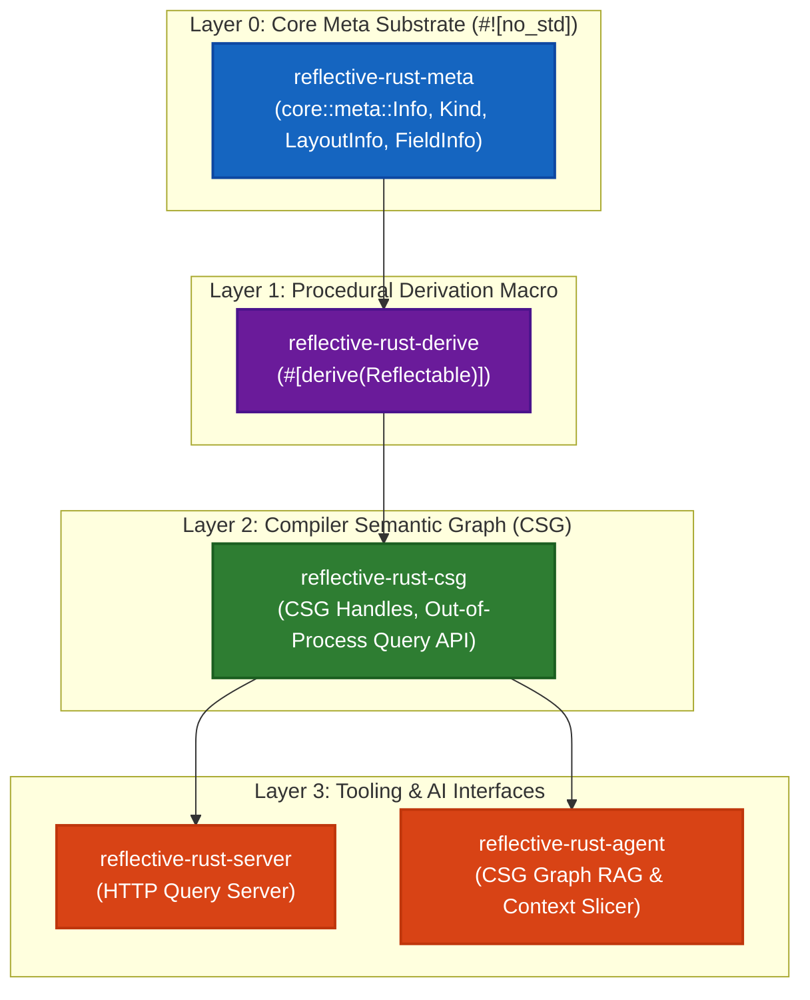

# Reflective Rust

[](LICENSE)
[](https://www.rust-lang.org)
[](AUTHORITY.md)

**Reflective Rust** is a comprehensive research program, language proposal, and reference implementation for **compile-time static reflection**, **Compiler Semantic Graph (CSG)** inspection, **runtime type projection**, **metaobject protocols**, and **AI context interfaces** in Rust.

It bridges zero-cost compile-time reflection (`#![no_std]` compatible `core::meta::Info`) with macro derivation (`#[derive(Reflectable)]`), out-of-process compiler semantic graph queries, and dynamic memory boundary inspection for WASM, FFI, and spatial runtimes.

---

## 1. Core Architectural Concepts



### Key Pillars
1. **`core::meta::Info` Substrate**: Non-forgeable, compiler-synthesized semantic handles (`Info`) representing types, structs, enums, fields, variants, and functions at compile-time with zero runtime overhead.
2. **`#[derive(Reflectable)]` Proc-Macro**: Automatic implementation of reflection metadata traits for custom structs and enums.
3. **Compiler Semantic Graph (CSG)**: Out-of-process JSON/gRPC semantic graph representation exposing complete AST, MIR, type layout, and field offset metadata.
4. **Runtime & Memory Boundary Projection**: Dynamic memory inspection (`size_of`, `align_of`, field offsets) for WASM, C-FFI, and IPC serialized buffers.

---

## 2. Workspace Crate Topology

| Crate Name | Directory | Target Substrate | Description |
| :--- | :--- | :--- | :--- |
| **`reflective-rust-meta`** | `crates/reflective-rust-meta/` | `#![no_std]` / `alloc` | Core static reflection handle types (`Info`, `Kind`, `LayoutInfo`, `FieldInfo`). |
| **`reflective-rust-derive`** | `crates/reflective-rust-derive/` | `proc-macro` | Procedural macro deriving `Reflectable` metadata implementations. |
| **`reflective-rust-csg`** | `crates/reflective-rust-csg/` | `std` | Compiler Semantic Graph query handle definitions & out-of-process JSON format. |
| **`reflective-rust-agent`** | `crates/reflective-rust-agent/` | `std` | CSG Graph RAG context slicer for AI agent integration. |
| **`reflective-rust-server`** | `crates/reflective-rust-server/` | `std` / `tokio` | Out-of-process HTTP query server for CSG graph inspection. |
| **`reflective-rust-cli`** | `crates/reflective-rust-cli/` | `std` | Command-line tool for static reflection analysis and CSG graph dumps. |
| **`reflective-rust-bench`** | `crates/reflective-rust-bench/` | `std` | Benchmark suite evaluating reflection compile time & WASM memory overhead. |

---

## 3. Quick Start & Code Examples

### A. Deriving Reflection Metadata
```rust
use reflective_rust_derive::Reflectable;
use reflective_rust_meta::{FieldInfo, Info, Kind, LayoutInfo};

#[derive(Debug, Clone, Reflectable)]
pub struct SpatialVector3D {
    pub x: f32,
    pub y: f32,
    pub z: f32,
}

fn main() {
    // Query type size and memory alignment
    let layout = SpatialVector3D::layout_info();
    println!("Size: {} bytes, Align: {} bytes", layout.size, layout.align);

    // Query semantic entity handle
    let type_info = SpatialVector3D::type_info();
    assert_eq!(type_info.kind(), Kind::Struct);

    // Iterate field metadata
    for field in SpatialVector3D::field_info() {
        println!("Field: {}, Offset: {} bytes", field.name, field.offset);
    }
}
```

### B. WASM Memory Boundary Inspection
```rust
use reflective_rust_meta::{Info, Kind};
use serde_json::json;

pub fn inspect_wasm_struct_layout<T: Reflectable>() -> String {
    let layout = T::layout_info();
    let fields = T::field_info();
    
    json!({
        "type_id": T::type_info().id(),
        "size_bytes": layout.size,
        "align_bytes": layout.align,
        "fields": fields.iter().map(|f| {
            json!({ "name": f.name, "offset": f.offset })
        }).collect::<Vec<_>>()
    }).to_string()
}
```

---

## 4. Hierarchy of Authority & Research Doctrine

In accordance with [AUTHORITY.md](AUTHORITY.md) and [.agents/AGENTS.md](.agents/AGENTS.md), conflicts across specs, code, and documentation resolve in strict canonical order:

$$\text{Architecture & Doctrine} \to \text{Ontology & Glossary} \to \text{Language Specification} \to \text{Substrate Code} \to \text{Generated Artifacts}$$

- **Status Honesty**: Features documented in specs are *documented*, not *implemented*. A feature is *tested* only when unit/conformance vectors pass.
- **Negative Result Retention**: Abandoned hypotheses and rejected macro designs are permanently archived in `docs/09-research/rejected-designs.md`.

---

## 5. Verification & Single-Command Gate

Before submitting pull requests or merging changes, execute the workspace verification suite:

```bash
# 1. Compile workspace & run all unit tests
cargo test --workspace

# 2. Validate mdBook links & reference integrity
node scratch/verify-links.mjs

# 3. Check workspace structure & document frontmatter
python3 scripts/check-structure.py

# 4. Re-generate single-file agent context corpus
node scripts/gen-llms.mjs
```

---

## 6. Documentation & Agent Corpora

- **mdBook Documentation**: Source chapters located in `docs/` (`book.toml`).
- **Agent Index**: [llms.txt](llms.txt) — High-level document manifest.
- **Single-File Corpus**: [llms-full.txt](llms-full.txt) — Consolidated ~260 KB single-file research corpus for zero-search AI context resolution.

---

## 7. License & Citation

Licensed under either of [MIT License](LICENSE-MIT) or [Apache License, Version 2.0](LICENSE-APACHE) at your option.

Academic deposits and metadata can be cited via [CITATION.cff](CITATION.cff):
```bibtex
@software{reflective_rust_2026,
  author = {Shallbetter, Zach and Reflective Rust Research Team},
  title = {Reflective Rust: Compile-Time Semantic Reflection and Metaobject Protocol for Rust},
  year = {2026},
  url = {https://github.com/zachshallbetter/reflective-rust}
}
```
